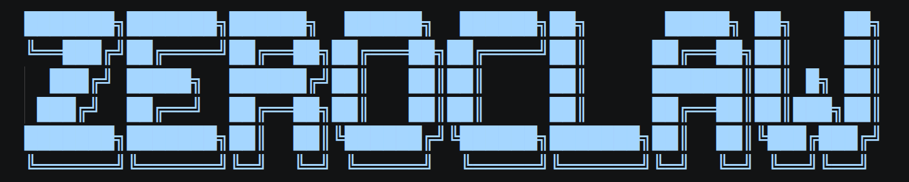

<p align="center">
  
</p>

# AgentZero 🦀

<p align="center">
  <strong>Zero overhead. Zero compromise. 100% Rust. 100% Agnostic.</strong><br>
  ⚡️ <strong>Runs on Raspberry Pi hardware with 20MB RAM </strong>
</p>

<p align="center">
  <a href="https://www.rust-lang.org"></a>
</p>

AgentZero is an agent runtime — a single Rust binary you configure and run. It talks to LLM providers (Anthropic, OpenAI, Ollama, and ~20 others). It answers you on the channels you already use (Slack, Discord, IRC, Email, Webhooks, and more). It has a web dashboard for real-time control and can connect to hardware peripherals (ESP32, STM32, Arduino, Raspberry Pi). The Gateway is the control plane — the product is the assistant.

If you want a personal, single-user assistant that feels local, fast, and always-on, this is it.

<p align="center">
  <a href="docs/README.md">Docs</a> ·
  <a href="docs/architecture/README.md">Architecture</a> ·
  <a href="#quick-start">Getting Started</a> ·
  <a href="docs/ops/troubleshooting.md">Troubleshoot</a> ·
</p>

The installer asks whether you want a prebuilt binary (fast, ~seconds) or a source build (slower, customisable). Both end the same way — `agentzero onboard` kicks off automatically.

Flags:

```
./install.sh --prebuilt              # always prebuilt; don't ask
./install.sh --source                # always build from source
./install.sh --minimal               # kernel only (~6.6 MB)
./install.sh --source --features agent-runtime,channel-discord  # custom feature set
./install.sh --skip-onboard          # install only, run `agentzero onboard` later
./install.sh --list-features         # print available feature flags
```

Platform-specific notes: see [setup guides](docs/setup-guides/README.md).

## Quick start

```bash
agentzero onboard                  # interactive onboard: provider, channels, agents, etc.
agentzero agent -a <alias>         # interactive chat using the [agents.<alias>] entry
agentzero service install          # register as systemd/launchctl/Windows Service
agentzero service start            # run it always-on in the background
```

## What AgentZero does

- **Multi-channel** — one agent answering you across [every channel you configure](docs/reference/api/channels-reference.md). Inbound messages from Discord, Slack, email, webhooks, CLI — all delivered to the same agent loop. Gateway supports webhook signature verification and rate limiting.
- **Provider-agnostic** — [model providers](docs/reference/api/providers-reference.md) are pluggable. Configure Anthropic, OpenAI, local Ollama, or any OpenAI-compatible endpoint. Fallback chains and routing keep the agent running when a provider flakes.
- **Security-first, with escape hatches** — default autonomy is `supervised`: medium-risk ops require approval, high-risk blocked. Workspace boundaries, command policy, OS-level sandboxes (Landlock / Bubblewrap / Seatbelt / Docker), and cryptographic [tool receipts](docs/security/README.md) on every action. YOLO mode exists for trusted dev environments.
- **Hardware-capable** — GPIO / I2C / SPI / USB on Raspberry Pi, STM32, Arduino, and ESP32 via the `Peripheral` trait. See [Hardware](docs/hardware/README.md).
- **Gateway + dashboard** — HTTP / WebSocket gateway for clients, with a web dashboard for chat, memory browsing, config editing, cron management, and tool inspection.
- **SOP engine** — event-triggered [Standard Operating Procedures](docs/reference/sop/README.md) (MQTT / webhook / cron / peripheral) with approval gates and resumable runs.
- **ACP** — IDE / editor integration via Agent Client Protocol (JSON-RPC 2.0 over stdio).

## Configuration

One TOML file at `~/.agentzero/config.toml`. Pointers:

- [Provider reference](docs/reference/api/providers-reference.md) — provider IDs, aliases, and credential env vars
- [Channels reference](docs/reference/api/channels-reference.md) — channel capabilities and setup details
- [Security overview](docs/security/README.md) — autonomy, sandboxing, tool receipts
- [Full config reference](docs/reference/api/config-reference.md) — generated from the live schema; every key documented

## Subscription Auth (OpenAI Codex / Claude Code)

For standard OpenAI Codex subscription auth, use stored auth profiles instead of setting an API key in the provider entry.

Notes:

- Normal OpenAI Codex subscription auth uses stored auth profiles, not an `api_key` on the provider entry.
- Only set `api_key` / `uri` on `[providers.models.openai.<alias>]` when intentionally targeting a custom OpenAI-compatible gateway or endpoint.
- If you see `provider streaming failed, falling back to non-streaming chat`, AgentZero retries the same request in non-streaming mode. Check `agentzero auth status` before changing provider config.

## Architecture

```
┌──────────────────────────────────────────────────────────────┐
│            channels       gateway        ACP                 │
│          (30+ adapters)   (REST/WS)    (JSON-RPC)            │
│                        ↓                                     │
│                   AgentZero runtime                          │
│         ┌──────────┬──────────┬──────────┐                   │
│         │  agent   │ security │   SOP    │                   │
│         │   loop   │  policy  │  engine  │                   │
│         └──────────┴──────────┴──────────┘                   │
│              ↓          ↓           ↓                        │
│          providers    tools      memory                      │
│         (Anthropic,  (shell,    (SQLite,                     │
│          OpenAI,     browser,    embeddings)                 │
│          Ollama,     HTTP,                                   │
│          ~20 more)   hardware)                               │
└──────────────────────────────────────────────────────────────┘
```

Full detail with Mermaid diagrams: [Architecture overview](docs/architecture/README.md).


## Agent workspace + skills

Workspace root: `~/.agentzero/workspace/` (configurable via config).

Injected prompt files:
- `IDENTITY.md` - agent personality and role
- `USER.md` - user context and preferences
- `MEMORY.md` - long-term facts and lessons
- `AGENTS.md` - session conventions and initialization rules
- `SOUL.md` - core identity and operating principles
- `CONSOLIDATION.md` - nightly memory consolidation job
- `HEARTBEAT.md` - tasks when you want to check something periodically
- `TOOLS.md` - environment reference
- `BOOTSTRAP.md` - onboarding reference


Skills: `~/.agentzero/workspace/skills/<skill>/SKILL.md` or `SKILL.toml`.


## License

AgentZero is dual-licensed for maximum openness and contributor protection:

| License | Use case |
|---|---|
| [MIT](LICENSE-MIT) | Open-source, research, academic, personal use |
| [Apache 2.0](LICENSE-APACHE) | Patent protection, institutional, commercial deployment |

You may choose either license. **Contributors automatically grant rights under both** — see [CONTRIBUTING.md](CONTRIBUTING.md) for the full contributor agreement.

### Contributor Protections

- You **retain copyright** of your contributions
- **Patent grant** (Apache 2.0) shields you from patent claims by other contributors
- Your contributions are **permanently attributed** in commit history and [NOTICE](NOTICE)
- No trademark rights are transferred by contributing
