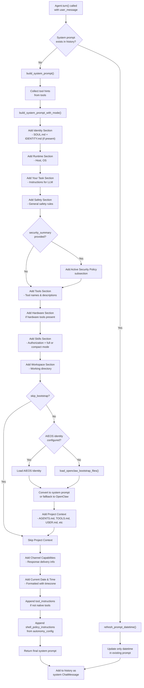

# Agent Prompt Building Flow

## Key Flow Points:

1. **Initialization Check** — On first turn, builds full system prompt; on subsequent turns, just refreshes the datetime
2. **Prompt Construction** — 10 main sections built in sequence:
   - Identity (SOUL.md + IDENTITY.md — frames everything)
   - Runtime info (host/OS — stable, cache-friendly, placed early)
   - Task instructions
   - Safety guidelines + active policy
   - Tools & Hardware access
   - Skills (authorization + definitions, contiguous)
   - Workspace context
   - Project context (bootstrap files or AIEOS)
   - Channel capabilities
   - Current date/time (dynamic tail for prompt cache stability)
3. **Conditional Sections** — Security policy, hardware access, and bootstrap files are conditionally injected
4. **Post-processing** — Tool and shell policy instructions appended if applicable
5. **History Management** — Final prompt stored as system message in conversation history

The prompt is modular and respects configuration options (AIEOS vs OpenClaw, native tools, skills mode, etc.).

## Source Code References

- **Agent.turn()**: `src/agent/agent.rs:594`
- **Agent.build_system_prompt()**: `src/agent/agent.rs:486`
- **build_system_prompt_with_mode()**: `src/channels/mod.rs:4688`
- **refresh_prompt_datetime()**: `src/agent/prompt.rs:11`
